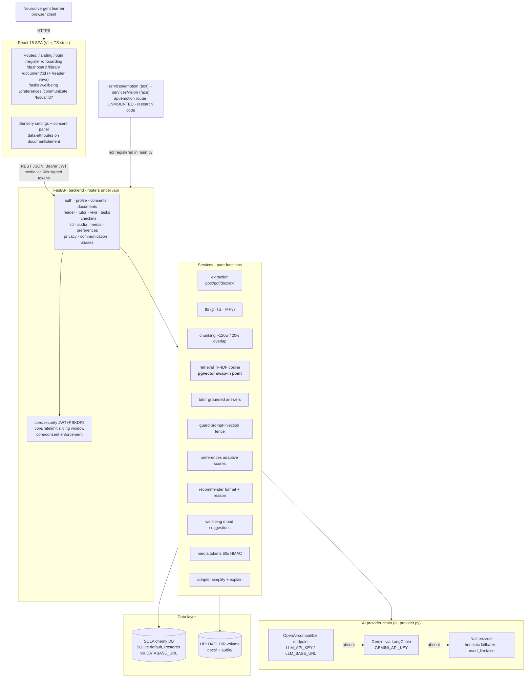
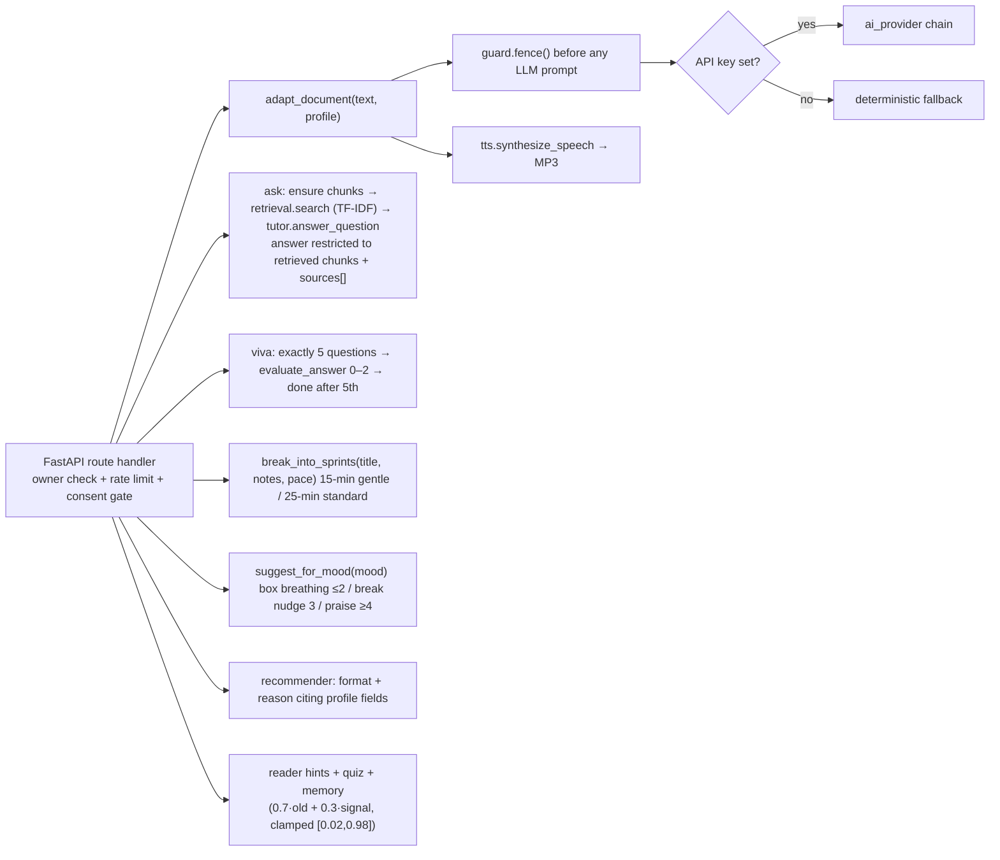

# NEUROLEARN (repo codename SahAIk) — Architecture

Status legend: **✅ shipped** = implemented and exercised by the offline test suite. **Research code** = present in the repo but NOT mounted in the running app. **Deferred** = specified as future work, not part of the release.

Source of truth: [`superpowers/specs/2026-08-21-sahaik-design.md`](superpowers/specs/2026-08-21-sahaik-design.md) §3; runtime truth: `backend/app/main.py` router registrations.

## 1. System context — actual topology

Notes:

- The frontend calls the API at `import.meta.env.VITE_API_BASE || "http://localhost:8000"`; the JWT is stored in `localStorage["sahaik_token"]`. No JWT is ever placed in a URL: document/viva-question downloads require a short-lived (60-second) stateless HMAC token from `POST /api/media/token`, and the privacy export requires the Bearer header.
- Graceful degradation is a hard rule: with no API key configured every LLM-assisted feature falls back to deterministic logic and reports `"used_llm": false` (or an honest empty payload for STT). The provider chain tries OpenAI-compatible → Gemini → Null.
- Camera-based facial-emotion recognition is excluded from the product (spec §2.4): the `/emotion/face` route exists only as unmounted research code and its absence from OpenAPI is covered by a test.

## 2. Request flow through the service layer

There is no cross-agent orchestrator in the shipped product (explicitly out of scope at feature freeze); each route calls its services directly. LangGraph wrappers exist for profiler/tutor/ef-coach/viva-coach in `app/agents/`, kept thin over the pure service functions.

Every LLM-assisted response carries a human-readable `explanation` and the honest `used_llm` flag; consent-denied features return calm HTTP 403s.

## 3. Component status table

| Component | Role | Status |
|---|---|---|
| React SPA (14 routed pages incl. Adaptive Reader, SprintBoard, VivaStudio, Wellbeing, Preferences, Communicate, FocusMode) | User-facing flows | ✅ shipped |
| Sensory settings + granular consent panel (voice/telemetry/memory, default off) | Accessibility & privacy | ✅ shipped |
| FastAPI REST API (`/api`) | All flows | ✅ shipped |
| JWT auth (HS256, 7-day) + PBKDF2 password hashing + IP/user rate limiting | Security | ✅ shipped |
| Consent enforcement server-side (403s) | Privacy | ✅ shipped |
| Extraction service (.pptx/.pdf/.docx/.txt) | Text extraction | ✅ shipped |
| TTS service (gTTS → MP3) | Audio output | ✅ shipped |
| Adapter (LLM simplify + heuristic fallback, explanations) | Content adaptation | ✅ shipped |
| Chunking (~120 words, 20-word overlap) + TF-IDF retrieval | Tutor grounding | ✅ shipped (`retrieval.py` = pgvector swap-in point) |
| Prompt-injection guard (pattern neutralisation + `<<<DATA>>>` fencing) | LLM safety | ✅ shipped |
| Tutor grounded Q&A with cited sources | RAG | ✅ shipped |
| EF Coach sprints | Executive function | ✅ shipped |
| Viva Coach text mode (exactly 5 questions) | Practice | ✅ shipped |
| Wellbeing check-ins + crisis-safe suggestions | Emotional wellbeing | ✅ shipped |
| Recommender (format + reason citing profile fields) | Modality ranking | ✅ shipped |
| Adaptive preference engine (transparent score rule, memory, analytics) | Personalization | ✅ shipped |
| Privacy suite (export, history wipe, DELETE /api/me cascade) | Data rights | ✅ shipped |
| Media tokens (60-second HMAC-signed URLs) | Secure downloads | ✅ shipped |
| OCR page-image upload (Gemini vision) | Inclusive input | ✅ shipped (honest 400 without key) |
| PostgreSQL + pgvector | Production data layer, embeddings | Deferred |
| Whisper LoRA fine-tune on TORGO | Atypical-speech-tolerant STT | Deferred |
| Orchestrator Coach (hub-and-spoke routing) | Cross-agent coordination | Deferred (out of freeze scope) |
| Text-emotion NB model (`services/emotion.py`) | Tone analysis of self-reported notes | ✅ shipped |
| Face-mood GNB model + `/emotion` router (`services/vision.py`) | Camera FER | Research code — **unmounted**, excluded by design (spec §2.4) |

## 4. Privacy and consent architecture

- Granular consent toggles per feature: `voice`, `telemetry`, `memory` (`GET/POST /api/consents`), all defaulting to **false**; enforcement lives server-side (`core/consent.py`) — voice gates STT/dictation surfaces, telemetry gates interaction logging, memory gates struggled-concept history.
- Plain-language AI disclosure on every agent surface.
- Explainability: every adaptation/recommendation/preference change returns a human-readable reason string shown in the UI.
- No camera-based facial-expression recognition anywhere in the running product (spec §2.4).
- Data rights implemented and tested: `GET /api/me/export` (full dump, Bearer-header download), `DELETE /api/interactions`, `DELETE /api/me` full cascade; media links expire after 60 seconds and carry signatures, not credentials.
